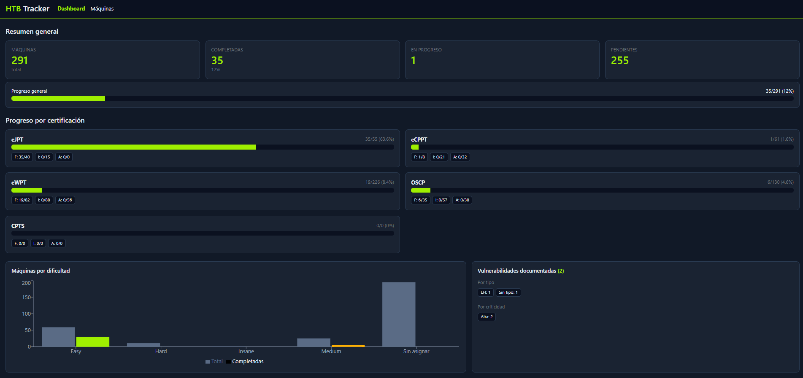
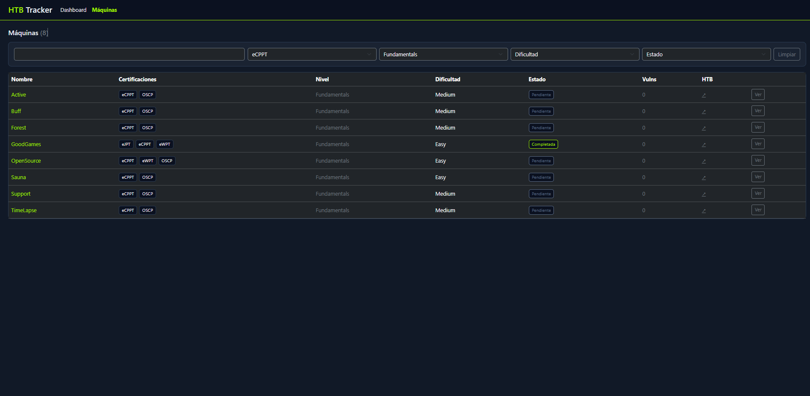

# HTB Tracker

Aplicación web full-stack para organizar mi estudio de **HackTheBox** por
certificaciones, niveles y máquinas, con seguimiento de progreso y documentación
de vulnerabilidades. Pensada para correr en local con Docker.

> Proyecto personal de aprendizaje: lo construí mientras me preparaba para
> certificaciones de pentesting (eJPT, eCPPT, eWPT, OSCP, CPTS), para llevar el
> control de casi 300 máquinas repartidas entre varias certificaciones — muchas
> de ellas compartidas.

---

## 📸 Capturas

### Dashboard



### Listado de máquinas con filtros



---

## ✨ Características

- **Dashboard** con resumen de progreso general, por certificación (con desglose
  por nivel) y gráficos por dificultad y vulnerabilidades.
- **Listado de máquinas** con filtros (certificación, nivel, dificultad, estado)
  y búsqueda por nombre.
- **Detalle de máquina**: cambio de estado (con fechas automáticas), notas,
  tiempo invertido y **CRUD de vulnerabilidades** (CVE, tipo, criticidad, CVSS y
  anotaciones en markdown).
- **Relación muchos-a-muchos**: una misma máquina puede pertenecer a varias
  certificaciones a la vez, así que al resolverla cuenta para todas.
- **Búsqueda global** y **API de estadísticas** para el dashboard.
- **Integración opcional con la API de HackTheBox** para sincronizar las máquinas
  resueltas automáticamente.

---

## 🧱 Stack

| Capa        | Tecnología                          |
|-------------|-------------------------------------|
| Frontend    | React + Vite, Recharts, Bootstrap   |
| Backend     | Node.js + Express                   |
| Base de datos | PostgreSQL                        |
| Orquestación | Docker Compose                     |

Arquitectura: el navegador habla con el frontend (Vite, puerto 3000), que llama a
la API (Express, puerto 3001) mediante un proxy; la API consulta PostgreSQL
(puerto 5432) por la red interna de Docker. Solo la API accede a la base de datos
y a la API externa de HackTheBox.

```
Navegador ──HTTP──▶ Frontend (React) ──/api──▶ Backend (Express) ──SQL──▶ PostgreSQL
                                                      └──HTTPS──▶ HackTheBox API
```

---

## 📂 Estructura

```
.
├── docker-compose.yml        # Orquesta db, adminer, backend y frontend
├── .env.example              # Plantilla de variables de entorno
├── db/init/                  # Esquema (01) y datos iniciales (02) - se cargan solos
├── backend/                  # API Express
│   └── src/
│       ├── server.js
│       ├── db.js
│       └── routes/           # certificaciones, maquinas, vulnerabilidades, stats, dashboard, search, htb
├── frontend/                 # App React + Vite
│   └── src/
│       ├── App.jsx
│       ├── components/Dashboard.jsx
│       └── pages/            # MaquinasList, MaquinaDetalle, HtbConfig
└── docs/SETUP_VM.md          # Guía para montar una VM Ubuntu + Docker
```

---

## 🚀 Puesta en marcha

Requisitos: **Docker** y **Docker Compose** (ver `docs/SETUP_VM.md` si lo montas en
una VM Ubuntu).

```bash
git clone https://github.com/Caan31/htb-tracker.git
cd htb-tracker

# Configura las credenciales de la base de datos
cp .env.example .env
# (edita .env y pon tu contraseña)

# Levanta todo
docker compose up -d --build
```

Cuando arranque por primera vez, PostgreSQL ejecuta automáticamente el esquema y
carga las máquinas de `db/init/`. Luego:

- App: <http://localhost:3000>
- API: <http://localhost:3001/api/health>
- Adminer (visor de la BD): <http://localhost:8080>

---

## ⚙️ Variables de entorno (`.env`)

```
POSTGRES_USER=htb_user
POSTGRES_PASSWORD=pon_aqui_una_contraseña
POSTGRES_DB=htb_tracker
```

> El `.env` está en `.gitignore` y **no se sube al repositorio**.

---

## 🔌 Endpoints principales de la API

| Método | Ruta | Descripción |
|--------|------|-------------|
| GET    | `/api/dashboard` | Datos completos del dashboard |
| GET    | `/api/certificaciones` | Certificaciones con su nº de máquinas |
| GET    | `/api/maquinas` | Máquinas (filtros: `certificacion_id`, `nivel`, `estado`, `dificultad`) |
| GET/PUT/DELETE | `/api/maquinas/:id` | Detalle / editar / borrar |
| PATCH  | `/api/maquinas/:id/estado` | Cambiar estado |
| GET/POST | `/api/maquinas/:id/vulnerabilidades` | Listar / crear vulnerabilidades |
| PUT/DELETE | `/api/vulnerabilidades/:id` | Editar / borrar |
| GET    | `/api/stats/...` | Estadísticas (por-certificacion, por-nivel, por-dificultad, timeline...) |
| GET    | `/api/search` | Búsqueda global |
| POST   | `/api/htb/authenticate` · `/api/htb/sync` | Integración con HackTheBox |

---

## 🔗 Integración con HackTheBox (opcional)

En la pestaña **HTB Sync** puedes pegar tu App Token (HackTheBox → Profile
Settings → App Tokens) para sincronizar automáticamente las máquinas que tengas
resueltas. Es totalmente opcional: la app funciona marcando los estados a mano.

---

## 📝 Licencia

[MIT](LICENSE).
